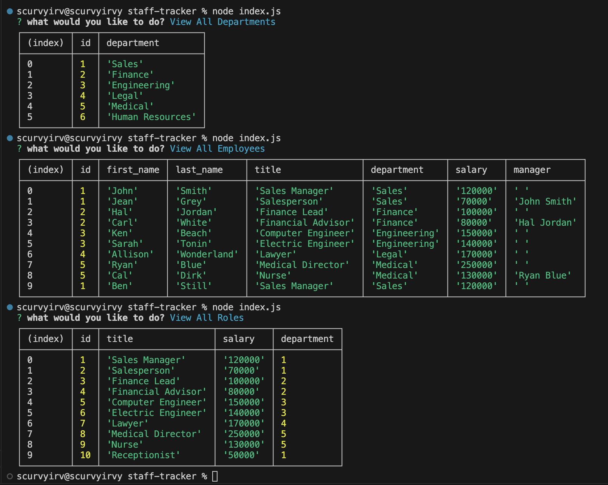

# staff-tracker

## Description

StaffTracker lets companies view, organize and assign departments, employees, and roles to centralize business planning and development. Using SQL, Postgres, and Node JS, you will manage your company with ease!

## Table of Contents

- db
    - query.sql
    - schema.sql
    - seeds.sql
- lib
    -options.js
- node modules
- index.js
- db.js
- license
- package-lock.json
- package.json
- README.md file

## Tasks 

- WHEN I enter VS Code, THEN I see a list of files on the left hand side
- WHEN I open the integrated terminal, THEN I enter the command 'node index.js' to begin user input entry
- WHEN I complete the prompts, THEN I can add a new employee, department, or role OR I can update employee role, OR I can view all employees, departments, or roles

## Usage
Here is a sample image of various tables you can generate:

## Links
- Video Usage [link to video](https://youtu.be/WF1X0kVQVD4): https://youtu.be/WF1X0kVQVD4
- Deployed Webpage: https://scurvyirv.github.io/staff-tracker/
- GitHub Repo Page: https://github.com/scurvyirv/staff-tracker

## Credits

- Postgres package: https://www.npmjs.com/package/pg
- Inquirer Package: https://www.npmjs.com/package/inquirer
- Node JS Package: https://docs.npmjs.com/downloading-and-installing-node-js-and-npm 

## License

MIT License

Copyright (c) 2024 scurvyirv

Permission is hereby granted, free of charge, to any person obtaining a copy of this software and associated documentation files (the "Software"), to deal in the Software without restriction, including without limitation the rights to use, copy, modify, merge, publish, distribute, sublicense, and/or sell copies of the Software, and to permit persons to whom the Software is furnished to do so, subject to the following conditions:

The above copyright notice and this permission notice shall be included in all copies or substantial portions of the Software.

THE SOFTWARE IS PROVIDED "AS IS", WITHOUT WARRANTY OF ANY KIND, EXPRESS OR IMPLIED, INCLUDING BUT NOT LIMITED TO THE WARRANTIES OF MERCHANTABILITY, FITNESS FOR A PARTICULAR PURPOSE AND NONINFRINGEMENT. IN NO EVENT SHALL THE AUTHORS OR COPYRIGHT HOLDERS BE LIABLE FOR ANY CLAIM, DAMAGES OR OTHER LIABILITY, WHETHER IN AN ACTION OF CONTRACT, TORT OR OTHERWISE, ARISING FROM, OUT OF OR IN CONNECTION WITH THE SOFTWARE OR THE USE OR OTHER DEALINGS IN THE SOFTWARE.